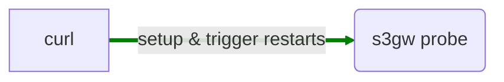
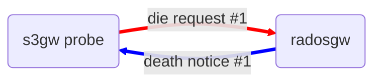
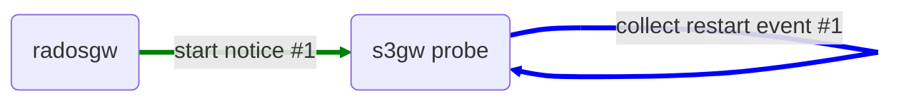
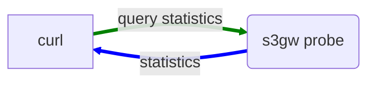

# s3gw-probe

- [s3gw-probe](#s3gw-probe)
  - [The tool](#the-tool)
  - [Local setup](#local-setup)
    - [Requirements](#requirements)
  - [Build the s3gw backend (radosgw) image](#build-the-s3gw-backend-radosgw-image)
    - [Prerequisites](#prerequisites)
    - [Build the s3gw's image](#build-the-s3gws-image)
    - [Push the s3gw's image](#push-the-s3gws-image)
  - [Build/Push the s3gw probe](#buildpush-the-s3gw-probe)
    - [Build the binary on localhost](#build-the-binary-on-localhost)
    - [Build the Docker image](#build-the-docker-image)
    - [Push the Docker image on the registry](#push-the-docker-image-on-the-registry)
  - [Create the cluster - K3d (Longhorn not supported)](#create-the-cluster---k3d-longhorn-not-supported)
    - [Delete the cluster](#delete-the-cluster)
    - [Deploy the s3gw on the cluster](#deploy-the-s3gw-on-the-cluster)
    - [Deploy the s3gw-probe tool on the cluster](#deploy-the-s3gw-probe-tool-on-the-cluster)
    - [Undeploy the s3gw and the testing tools from the cluster](#undeploy-the-s3gw-and-the-testing-tools-from-the-cluster)
  - [Create the cluster - Vagrant + libvirt (Longhorn supported)](#create-the-cluster---vagrant--libvirt-longhorn-supported)
    - [Delete the cluster](#delete-the-cluster-1)
    - [Connect to the nodes](#connect-to-the-nodes)
  - [Probe examples](#probe-examples)
  - [License](#license)

## The tool

The `s3gw Probe` is a program developed with the purpose of collecting restart
events coming from the `radosgw` process.
The tool is acting as a client/server service inside the Kubernetes cluster.

- It acts as client vs the `radosgw` process requesting it to die.
- It acts as server of `radosgw` process collecting its `death` and `start` events.
- It acts as server of the user's client accepting configurations of restart
  scenarios to be triggered against the `radosgw` process.
- It acts as server of the user's client returning statistics over the collected
  data.

In nutshell:

- The `s3gw Probe` can be instructed to trigger `radosgw` restarts
  with a RESTful call.
- The `s3gw Probe` can be queried for statistics over the collected data.

The usage sequence for the s3gw Probe is the following:

- The user instructs the tool



- The tool performs the `die request` cycle collecting the `death` and `start`
  events from the `radosgw` process.





- The user queries the tool for the statistics



The `radosgw` code has been patched to accept a REST call from the probe
where the user can specify the way the `radosgw` will exit.

Currently, 4 modes are possible against the `radosgw`:

- `exit0`
- `exit1`
- `segfault`
- `regular`

Inside a Kubernetes environment, the tool can pilot the `control plane` to scale
down and up the s3gw's backend pod.

Currently, 2 modes are possible against the `control plane`:

- `k8s_scale_deployment_0_1`
- `k8s_scale_deployment_0_1_node_rr`

## Local setup

### Requirements

- Docker, Docker compose
- Ansible
- libvirt
- Helm
- k3d
- kubectl
- Go (1.20+)
- If you intend to build radosgw *locally* you have to ensure its specific requirements.

## Build the s3gw backend (radosgw) image

> WARNING: The radosgw built from this repository contains
> customized and unsecure patches specifically developed to interact
> with the custom s3gw-probe program.

### Prerequisites

> Ensure to execute the following command
> after the clone.

```shell
git submodule update --init --recursive
```

### Build the s3gw's image

```shell
make s3gw-cmake
```

```shell
make s3gw-build
```

> **Be patient**: this will take long.

After the command completes successfully,
you will see the following images:

```shell
docker images
```

- `registry/s3gw/s3gw:{@TAG}`

Where `{@TAG}` is the evaluation of the following expression:

```bash
$(git describe --tags --always)
```

### Push the s3gw's image

```shell
make s3gw-push-image
```

## Build/Push the s3gw probe

```shell
make tidy
```

### Build the binary on localhost

```shell
make probe-build
```

### Build the Docker image

```shell
make probe-docker-build
```

### Push the Docker image on the registry

```shell
make probe-push-image
```

## Create the cluster - K3d (Longhorn not supported)

You create the `k3d-s3gw-ha` cluster with:

```shell
make k3d-start
```

> **WARNING**: the command updates your `.kube/config` with the credentials of
> the just created `k3d-s3gw-ha` cluster and sets its context as default.

### Delete the cluster

```shell
make k3d-delete
```

### Deploy the s3gw on the cluster

```shell
make k3d-deploy
```

### Deploy the s3gw-probe tool on the cluster

```shell
make k3d-probe-deploy
```

### Undeploy the s3gw and the testing tools from the cluster

```shell
make k3d-undeploy
```

## Create the cluster - Vagrant + libvirt (Longhorn supported)

Build and provision virtual machine based k8s cluster with `s3gw` + `Longhorn`
and the `s3gw-probe`:

```shell
$ cd vm
$ WORKER_COUNT=2 ./do.sh start

Starting environment ...
WORKER_COUNT=2
Bringing machine 'admin-1' up with 'libvirt' provider...
Bringing machine 'worker-1' up with 'libvirt' provider...
Bringing machine 'worker-2' up with 'libvirt' provider...
```

### Delete the cluster

```shell
$ cd vm
$ WORKER_COUNT=2 ./do.sh destroy

Destroying
```

### Connect to the nodes

```shell
$ cd vm
$ WORKER_COUNT=2 vagrant ssh admin-1
..
$ WORKER_COUNT=2 vagrant ssh worker-1
..
$ WORKER_COUNT=2 vagrant ssh worker-2
```

## Probe examples

You can trigger scenarios for the `radosgw`'s POD with an `HTTP` call vs the probe
as follow:

- HTTP METHOD: `PUT`
- URI: `/trigger`

Examples

- 10 restarts, death by: `exit0`: Query string: `restarts=10&how=exit0&mark=my-exit0-test`
- 10 restarts, death by: `exit1`: Query string: `restarts=10&how=exit1&mark=my-exit1-test`
- 10 restarts, death by: `segfault`: Query string: `restarts=10&how=segfault&mark=my-segfault-test`

You ask for stats with an `HTTP` call vs the probe as follow:

- HTTP METHOD: `GET`
- URI: `/stats`

## License

Copyright (c) 2023 [SUSE, LLC](http://suse.com)

Licensed under the Apache License, Version 2.0 (the "License");
you may not use this file except in compliance with the License.
You may obtain a copy of the License at

[http://www.apache.org/licenses/LICENSE-2.0](http://www.apache.org/licenses/LICENSE-2.0)

Unless required by applicable law or agreed to in writing, software
distributed under the License is distributed on an "AS IS" BASIS,
WITHOUT WARRANTIES OR CONDITIONS OF ANY KIND, either express or implied.
See the License for the specific language governing permissions and
limitations under the License.
